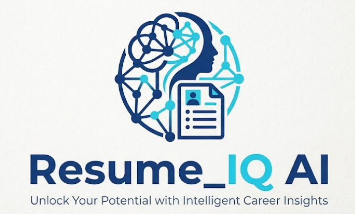

# 📄 ResumeIQ AI

<div align="center">



### AI-Powered Resume Analyzer & ATS Optimizer

Analyze resumes, calculate ATS scores, improve resume sections using Gemini AI, compare resumes with job descriptions, chat with your resume, and export professional reports.


</div>

---

# 📌 Overview

ResumeIQ AI is an intelligent Resume Analysis Platform that helps students and professionals optimize their resumes for Applicant Tracking Systems (ATS).

The application combines traditional resume parsing techniques with Google's Gemini AI to provide intelligent resume improvements, ATS analysis, resume-job matching, interview preparation, and downloadable reports.

The entire application is built using **Streamlit**, making it lightweight, interactive, and easy to use.

---

# ✨ Features

## 📊 Resume Analysis

- Upload PDF or DOCX resumes
- Automatic resume parsing
- Resume statistics
- Resume preview
- Resume section detection
- Missing section detection
- ATS keyword identification

---

## 🎯 ATS Score Calculator

The ATS engine evaluates resumes based on:

- Contact Information
- Resume Length
- Resume Sections
- Technical Keywords
- Formatting Quality
- Bullet Point Usage

It generates:

- Overall ATS Score
- Keyword Score
- Formatting Score
- Section Score
- Improvement Suggestions

---

## 🧠 Skill Extraction

Automatically detects technical skills including:

- Programming Languages
- Frameworks
- AI & Machine Learning
- Databases
- Cloud Platforms
- Data Analytics Tools
- Developer Tools

The application also displays an interactive Skill Distribution Chart.

---

## 🤖 AI Resume Improvement

Powered by **Google Gemini 2.5 Flash**

Improve individual resume sections such as:

- Summary
- Education
- Skills
- Projects
- Certifications
- Experience

The AI:

- Improves grammar
- Uses ATS-friendly wording
- Uses stronger action verbs
- Preserves original meaning
- Never invents information

---

## 🎯 Resume vs Job Description Match

Compare your resume with a Job Description.

The system provides:

- Overall Match Percentage
- Semantic Similarity
- Skill Match Percentage
- Missing Skills
- Matched Skills
- Additional Skills

---

## 💬 Resume Chat Assistant

Interact with your resume using AI.

Available actions include:

- ATS Feedback
- Improve Professional Summary
- Recommend Skills
- Generate Interview Questions
- Suggest Portfolio Projects
- Ask Custom Questions

---

## 📜 Resume Analysis History

Automatically stores every analysis.

Features include:

- Previous Resume Records
- ATS Scores
- Analysis Date
- Delete Records
- Clear History

SQLite is used for persistent storage.

---

## 📄 Export Reports

Export resume analysis as:

- PDF Report
- JSON Report
- CSV Report

Reports include:

- ATS Score
- Resume Statistics
- Skills
- Resume Sections
- ATS Suggestions

---

# 🖼️ Application Screenshots

## Home Dashboard


---

## Resume Analysis


---

## AI Resume Improvement


---

## Resume Chat


---

## Export Reports


---

## Analysis History


---

# ⚙️ Technology Stack

## Frontend

- Streamlit

## Backend

- Python

## Artificial Intelligence

- Google Gemini 2.5 Flash

## NLP

- spaCy
- Sentence Transformers

## Machine Learning

- all-MiniLM-L6-v2

## Visualization

- Plotly

## Database

- SQLite

## PDF Generation

- ReportLab

## PDF Parsing

- PyMuPDF

## DOCX Parsing

- python-docx

---

# 📂 Project Structure

```
ResumeIQ_AI
│
├── assets/
│   ├── logo.png
│   └── style.css
│
├── components/
│   ├── sidebar.py
│   ├── uploader.py
│   ├── score_card.py
│   ├── skill_chart.py
│   ├── dashboard.py
│   ├── improvement_panel.py
│   ├── match_dashboard.py
│   └── resume_preview.py
│
├── database/
│   ├── history.py
│   └── init_db.py
│
├── pages/
│   ├── Resume Analysis.py
│   ├── AI Resume Improvement.py
│   ├── Job Match.py
│   ├── History.py
│   ├── Export Report.py
│   └── Resume Chat.py
│
├── services/
│   ├── ats_service.py
│   ├── resume_analyzer.py
│   ├── resume_chat.py
│   ├── job_match_service.py
│   ├── job_parser.py
│   ├── skill_extractor.py
│   ├── section_detector.py
│   ├── resume_improver.py
│   ├── gemini_service.py
│   ├── export_pdf.py
│   ├── export_csv.py
│   └── export_json.py
│
├── utils/
│
├── uploads/
├── generated/
│
├── app.py
├── config.py
├── requirements.txt
└── README.md
```

---

# 🚀 Installation

Clone the repository

```bash
git clone https://github.com/YOUR_USERNAME/ResumeIQ_AI.git
```

Go inside the project

```bash
cd ResumeIQ_AI
```

Create a virtual environment

```bash
python -m venv .venv
```

Activate it

Windows

```bash
.venv\Scripts\activate
```

Install dependencies

```bash
pip install -r requirements.txt
```

---

# 🔑 Environment Variables

Create a `.env` file

```
GEMINI_API_KEY=YOUR_GEMINI_API_KEY
```

---

# ▶️ Run the Application

```bash
streamlit run app.py
```

---

# 🔄 Application Workflow

```
Upload Resume
      │
      ▼
Extract Resume Text
      │
      ▼
Section Detection
      │
      ▼
Skill Extraction
      │
      ▼
ATS Score Calculation
      │
      ▼
Gemini AI Processing
      │
      ▼
Resume Improvement
      │
      ▼
Job Match Analysis
      │
      ▼
Resume Chat
      │
      ▼
Export Reports
```

---

# 🎯 Key Highlights

✔ ATS Score Calculation

✔ Resume Parsing

✔ AI Resume Improvement

✔ Resume Chat Assistant

✔ Semantic Resume Matching

✔ Skill Gap Analysis

✔ Interactive Dashboards

✔ PDF / JSON / CSV Export

✔ Resume History

✔ SQLite Integration

✔ Gemini AI Integration

✔ Streamlit Web Application

---

# 📚 Python Libraries Used

- streamlit
- google-generativeai
- spacy
- sentence-transformers
- plotly
- pymupdf
- python-docx
- reportlab
- sqlite3
- python-dotenv

---

# 🔮 Future Improvements

- User Authentication
- Resume Ranking
- Cover Letter Generator
- OCR for Image-based Resumes
- LinkedIn Resume Import
- Multiple Resume Comparison
- AI Career Roadmap
- Resume Templates
- Multi-language Support
- Cloud Deployment with Docker

---

# 👨‍💻 Developer

**Smruti Ranjan Nayak**

B.Tech – Computer Science & System Engineering

KIIT University, Bhubaneswar

---

# ⭐ If you like this project

Give this repository a ⭐ on GitHub.

It motivates future development and helps others discover the project.

---

# 📄 License

This project is licensed under the MIT License.
